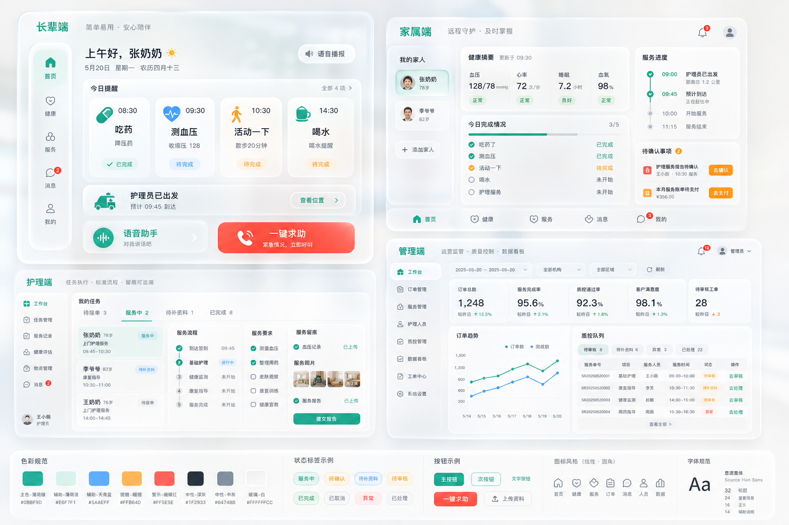

# CareNest 前端视觉风格规范

## 1. 风格定位

CareNest 前端统一采用 **Apple-inspired Spatial Glass Healthcare UI**。

整体观感应像一个高端、可信、低焦虑的智慧护理系统：有 Apple-like 的轻盈、留白、半透明层级和精致排版，但不复制 iOS、macOS 或 visionOS 的具体界面，也不使用任何 Apple 标志。

核心关键词：

- 半透明玻璃
- 暖白空间
- 柔和青绿
- 悬浮层级
- 低噪音
- 高留白
- 医疗可信
- 适老清晰
- 运营克制

参考图：



## 2. 风格提示词

后续生成页面、组件、截图或视觉稿时，优先使用以下提示词：

```text
Apple-inspired Spatial Glass Healthcare UI,
luminous warm white background,
frosted glass panels,
soft ambient shadow,
hairline divider,
medical teal accent,
gentle mint surface,
muted amber reminder,
restrained coral emergency,
light graphite text,
large accessible elder controls,
calm healthcare operations,
premium minimal interface,
low anxiety,
high whitespace,
rounded linear icons
```

禁止提示词：

```text
Apple logo,
copied iOS screen,
copied macOS window,
dark full-page theme,
marketing hero,
decorative blobs,
heavy gradients,
neon colors,
stock photos,
people photos,
busy card wall,
overlapping text
```

## 3. 色彩规范

| 用途 | 建议色值 | 使用说明 |
| --- | --- | --- |
| 暖白背景 | `#f7faf8` | 页面主背景，保持干净和低焦虑 |
| 雾白玻璃 | `rgba(255,255,255,0.68)` | 主面板、浮层、侧栏 |
| 医疗青绿 | `#0b8f9d` | 主按钮、选中态、关键健康状态 |
| 深青绿 | `#087b78` | 主色深态、强调文字 |
| 浅薄荷 | `#dff7f0` | 健康、完成、轻提示背景 |
| 琥珀提醒 | `#ffb84d` | 待确认、提醒、未完成事项 |
| 克制珊瑚红 | `#ff5e5b` | 一键求助、异常、投诉、超时 |
| 石墨文字 | `#152033` | 主标题与关键数据 |
| 中性说明 | `#64748b` | 次级说明、表格辅助信息 |
| 发丝分隔 | `rgba(120,144,156,0.22)` | 边框和分隔线 |

页面不应被单一色相填满。青绿作为系统识别色，红色只用于高优先级风险，不用于普通装饰。

## 4. 组件规范

- **背景**：使用暖白到冷白的轻微空间感，不做明显彩色光球或营销式渐变。
- **面板**：主面板使用半透明白色、背景模糊、发丝边框和轻阴影，形成悬浮层级。
- **圆角**：普通控件 12px，信息面板 18px，主容器 24px 左右；后台表格区域可更克制。
- **按钮**：长辈端按钮高度不低于 56px；其他端主按钮不低于 40px。危险按钮使用珊瑚红，文案短而明确。
- **状态标签**：使用 pill 样式，颜色低饱和。常用状态包括 `服务中`、`待确认`、`待审核`、`待补资料`、`已完成`、`异常`。
- **图标**：使用圆角线性图标，图标只辅助识别，不承担装饰。
- **阴影**：使用柔和环境阴影，避免厚重卡片堆叠。
- **文字**：中文优先系统无衬线。标题短，状态靠前，说明文字控制在一行或两行内。

## 5. 四端差异

### 长辈端

- 端形态：uni-app 移动端。
- 最适老，字号最大，按钮最大，跳转最少。
- 首页优先呈现今日提醒、待上门服务、健康反馈、语音助手和一键求助。
- 一键求助可以使用明确红色，但整体不能压迫。

### 家属端

- 端形态：uni-app 移动端。
- 像远程照护控制台，重点是老人现在怎么样、服务到哪一步、是否需要处理。
- 使用健康摘要、时间线、待确认事项和状态标签，不堆复杂图表。

### 护理端

- 端形态：uni-app 移动端。
- 像任务执行工作台，流程感强。
- 重点展示接下来做什么、哪些必须留档、哪些指标未完成、如何提交报告。
- 温情叙事减少，操作路径清晰。

### 管理端

- 端形态：电脑网页端 / PC Web 管理工作台，不按移动端 App 形态实现。
- 像运营监管和质控中枢。
- 保持 Apple-like 留白和玻璃层级，但信息密度高于其他端。
- 重点展示订单趋势、服务完成率、留档完整率、审核队列和异常工单。
- 布局固定为桌面侧栏 + 宽屏内容区；小屏预览允许横向滚动，不折叠成手机端页面。

## 6. 后续开发约束

- 所有前端阶段开始前，先参考本文件，再实现页面。
- 本文件只约束视觉与交互表达，不覆盖接口契约；接口路径、DTO、状态枚举仍以 PDF、`docs/api/` 和 `docs/dictionary/` 为准。
- 后续如需新增状态颜色或组件样式，必须同步更新本文件。
- 页面必须可视化验收，截图保存到 `docs/stage-check/`。
